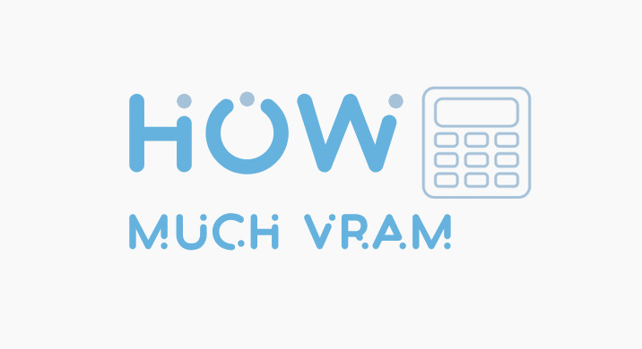
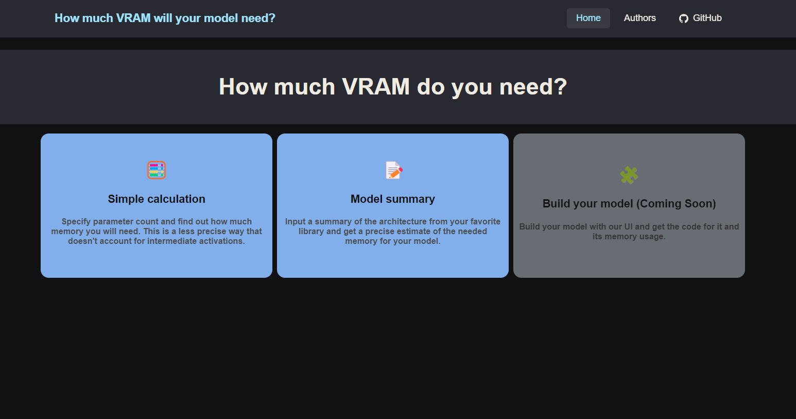

# How Much VRAM

:star: Star us on GitHub — it motivates us a lot!

[How Much VRAM](https://howmuchvram.com) is an open source project for estimating the memory that your model will need for training or inference. This will help you decide the hardware that you will need for it wihthout trying many configurations.

## Table Of Content

- [Running local](#installation)
    - 
- [Collaborate](#Collaborate)

- [License](#license)
- 
- [Links](#links)

## Installation

For developing and running the frontend in localhost, you need to open your terminal in the Frontend folder of this repository and then run:
- npm install .
- npm run dev
and then open in a browser localhost in the port that it tells you, for example, search: http://localhost:5173/

## Collaborate

This repository aims to grow in functionalities, and your contributions are highly appreciated. if you want to contribute to the project create a fork and make a pull request with your feature. 

Some development ideas that we want to add in the future are:
- GPU or instance recommendation for the model
- Build a model with blocks, and get the needed usage with even more precision than the summary by having the inside consumption of each block. Also the source code could be automatically created for that model.
- Create a mapping of each important block (for example Transformer Encoder) so that when it appears in a summary, the inside activations and extra memmory used can be added to the estimation.

If you'd like to work on this don't be shy to contact us.

## License

This project is licensed under the terms of the mozilla public license (mpl) and is available for free.

## Links

* [Web site](https://howmuchvram.com/)
* [Source code](https://github.com/AlexBodner/How_Much_VRAM)
